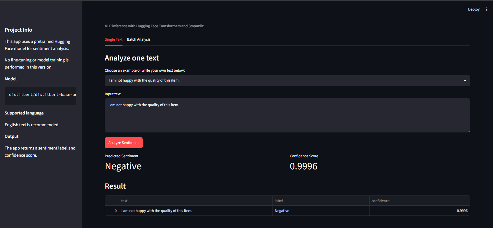

# Sentiment Analysis App — NLP with Hugging Face and Streamlit

## Overview

This project is a simple web application for sentiment analysis using a pretrained Hugging Face Transformers model and Streamlit.

The app allows users to enter text, run sentiment prediction, view the predicted label and confidence score, analyze multiple texts in batch, and download results as a CSV file.

This project focuses on NLP inference, not model training. No fine-tuning is performed in this version.

## Model Used

The application uses the following pretrained Hugging Face model:

```text
distilbert/distilbert-base-uncased-finetuned-sst-2-english
```

This model is a DistilBERT checkpoint fine-tuned on SST-2 for English sentiment classification.

The model returns sentiment labels such as:

```text
POSITIVE
NEGATIVE
```

## How to Run

### 1. Clone the repository

```bash
git clone https://github.com/Rocnarx/sentiment-analysis-app.git
cd sentiment-analysis-streamlit
```

### 2. Create a virtual environment

```bash
python -m venv .venv
```

### 3. Install dependencies

```bash
pip install -r requirements.txt
```

### 4. Run the Streamlit app

```bash
streamlit run app.py
```

### 5. Open the app

```text
http://localhost:8501
```

The first run may take longer because the pretrained model must be downloaded.

## Example Inputs and Outputs

### Example 1

Input:

```text
I really enjoyed this product. It works exactly as expected.
```

Example output:

```text
Label: Positive
Confidence: 0.9998
```

### Example 2

Input:

```text
The service was slow and the experience was disappointing.
```

Example output:

```text
Label: Negative
Confidence: 0.9987
```

The confidence scores above are examples. Actual values may vary depending on the installed library versions and model files.

## Batch Analysis

The app supports batch sentiment analysis in two ways:

1. Enter one text per line.
2. Upload a CSV file with a column named `text`.

Example CSV format:

```csv
text
I love this app.
The delivery was late and the product was damaged.
The experience was okay.
```

The app displays the predictions in a table and allows users to download the results as a CSV file.

```markdown

```

## Project Structure

```text
sentiment-analysis-streamlit/
│
├── app.py
├── requirements.txt
├── .gitignore
├── README.md
│
├── assets/
│   └── .gitkeep
│
└── outputs/
    └── .gitkeep
```